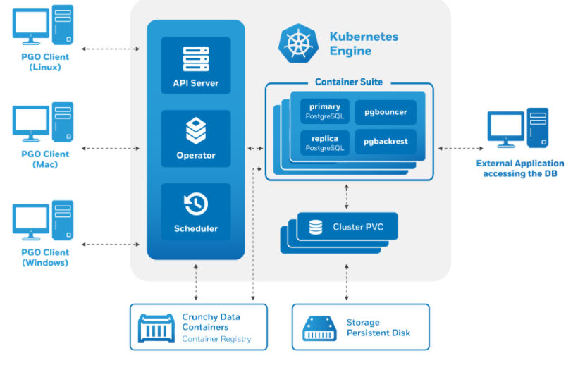

<h1 align="center">Crunchy Data PostgreSQL Operator</h1>


# Run your own production-grade PostgreSQL-as-a-Service on Kubernetes!

The [Crunchy PostgreSQL Operator][documentation] automates and simplifies deploying and managing
open source PostgreSQL clusters on Kubernetes and other Kubernetes-enabled Platforms by providing
the essential features you need to keep your PostgreSQL clusters up and running, including:

#### PostgreSQL Cluster [Provisioning][provisioning]

[Create, Scale, & Delete PostgreSQL clusters with ease][provisioning], while fully customizing your
Pods and PostgreSQL configuration!

#### [High Availability][high-availability]

Safe, automated failover backed by a [distributed consensus based high-availability solution][high-availability].
Uses [Pod Anti-Affinity][k8s-anti-affinity] to help resiliency; you can configure how aggressive this can be!
Failed primaries automatically heal, allowing for faster recovery time.

Support for [standby PostgreSQL clusters][multiple-cluster] that work both within and across [multiple Kubernetes clusters][multiple-cluster].

#### [Disaster Recovery][disaster-recovery]

Backups and restores leverage the open source [pgBackRest][] utility and
[includes support for full, incremental, and differential backups as well as efficient delta restores][disaster-recovery].
Set how long you want your backups retained for. Works great with very large databases!

#### TLS

Secure communication between your applications and data servers by [enabling TLS for your PostgreSQL servers][pgo-task-tls],
including the ability to enforce that all of your connections to use TLS.

#### [Monitoring][monitoring]

[Track the health of your PostgreSQL clusters][monitoring] using the open source [pgMonitor][] library.

#### PostgreSQL User Management

Quickly add and remove users from your PostgreSQL clusters with powerful commands. Manage password
expiration policies or use your preferred PostgreSQL authentication scheme.

#### Upgrade Management

Safely apply PostgreSQL updates with minimal availability impact to your PostgreSQL clusters.

#### Advanced Replication Support

Choose between [asynchronous replication][high-availability] and [synchronous replication][high-availability-sync]
for workloads that are sensitive to losing transactions.

#### Clone

Create new clusters from your existing clusters or backups with [`pgo create cluster --restore-from`][pgo-create-cluster].

#### Connection Pooling

Use [pgBouncer][] for connection pooling

#### Node Affinity

Have your PostgreSQL clusters deployed to [Kubernetes Nodes][k8s-nodes] of your preference

#### Scheduled Backups

Choose the type of backup (full, incremental, differential) and [how frequently you want it to occur][disaster-recovery-scheduling] on each PostgreSQL cluster.

#### Backup to S3

[Store your backups in Amazon S3][disaster-recovery-s3] or any object storage system that supports
the S3 protocol. The PostgreSQL Operator can backup, restore, and create new clusters from these backups.

#### Multi-Namespace Support

You can control how the PostgreSQL Operator leverages [Kubernetes Namespaces][k8s-namespaces] with several different deployment models:

- Deploy the PostgreSQL Operator and all PostgreSQL clusters to the same namespace
- Deploy the PostgreSQL Operator to one namespaces, and all PostgreSQL clusters to a different namespace
- Deploy the PostgreSQL Operator to one namespace, and have your PostgreSQL clusters managed across multiple namespaces
- Dynamically add and remove namespaces managed by the PostgreSQL Operator using the `pgo create namespace` and `pgo delete namespace` commands

#### Full Customizability

The Crunchy PostgreSQL Operator makes it easy to get your own PostgreSQL-as-a-Service up and running on Kubernetes-enabled platforms, but we know that there are further customizations that you can make. As such, the Crunchy PostgreSQL Operator allows you to further customize your deployments, including:

- Selecting different storage classes for your primary, replica, and backup storage
- Select your own container resources class for each PostgreSQL cluster deployment; differentiate between resources applied for primary and replica clusters!
- Use your own container image repository, including support `imagePullSecrets` and private repositories
- [Customize your PostgreSQL configuration](https://access.crunchydata.com/documentation/postgres-operator/latest/advanced/custom-configuration/)
- Bring your own trusted certificate authority (CA) for use with the Operator API server
- Override your PostgreSQL configuration for each cluster


[disaster-recovery]: https://access.crunchydata.com/documentation/postgres-operator/latest/architecture/disaster-recovery/
[disaster-recovery-s3]: https://access.crunchydata.com/documentation/postgres-operator/latest/architecture/disaster-recovery/#using-s3
[disaster-recovery-scheduling]: https://access.crunchydata.com/documentation/postgres-operator/latest/architecture/disaster-recovery/#scheduling-backups
[high-availability]: https://access.crunchydata.com/documentation/postgres-operator/latest/architecture/high-availability/
[high-availability-sync]: https://access.crunchydata.com/documentation/postgres-operator/latest/architecture/high-availability/#synchronous-replication-guarding-against-transactions-loss
[monitoring]: https://access.crunchydata.com/documentation/postgres-operator/latest/architecture/monitoring/
[multiple-cluster]: https://access.crunchydata.com/documentation/postgres-operator/latest/architecture/high-availability/multi-cluster-kubernetes/
[pgo-create-cluster]: https://access.crunchydata.com/documentation/postgres-operator/latest/pgo-client/reference/pgo_create_cluster/
[pgo-task-tls]: https://access.crunchydata.com/documentation/postgres-operator/latest/pgo-client/common-tasks/#enable-tls
[provisioning]: https://access.crunchydata.com/documentation/postgres-operator/latest/architecture/provisioning/

[k8s-anti-affinity]: https://kubernetes.io/docs/concepts/configuration/assign-pod-node/#inter-pod-affinity-and-anti-affinity
[k8s-namespaces]: https://kubernetes.io/docs/concepts/overview/working-with-objects/namespaces/
[k8s-nodes]: https://kubernetes.io/docs/concepts/architecture/nodes/

[pgBackRest]: https://www.pgbackrest.org
[pgBouncer]: https://access.crunchydata.com/documentation/pgbouncer/
[pgMonitor]: https://github.com/CrunchyData/pgmonitor


## Deployment Requirements

The PostgreSQL Operator is validated for deployment on Kubernetes, OpenShift, and VMware Enterprise PKS clusters.  Some form of storage is required, NFS, hostPath, and Storage Classes are currently supported.

The PostgreSQL Operator includes various components that get deployed to your
Kubernetes cluster as shown in the following diagram and detailed
in the Design section of the documentation for the version you are running.



The PostgreSQL Operator is developed and tested on CentOS and RHEL Linux platforms but is known to run on other Linux variants.

### Supported Platforms

The Crunchy PostgreSQL Operator is tested on the following Platforms:

- Kubernetes 1.13+
- OpenShift 3.11+
- Google Kubernetes Engine (GKE), including Anthos
- Amazon EKS
- VMware Enterprise PKS 1.3+

### Storage

The Crunchy PostgreSQL Operator is tested with a variety of different types of Kubernetes storage and Storage Classes, including:

- Google Compute Engine persistent volumes
- HostPath
- NFS
- Rook
- StorageOS

and more.

We know there are a variety of different types of [Storage Classes](https://kubernetes.io/docs/concepts/storage/storage-classes/) available for Kubernetes and we do our best to test each one, but due to the breadth of this area we are unable to verify PostgreSQL Operator functionality in each one. With that said, the PostgreSQL Operator is designed to be storage class agnostic and has been demonstrated to work with additional Storage Classes.

## Installation

### PostgreSQL Operator Installation

The PostgreSQL Operator provides a few different methods for installation based on your use case.

Based on your storage settings in your Kubernetes environment, you may be able to start as quickly as:

```shell
kubectl create namespace pgo
kubectl apply -f https://raw.githubusercontent.com/CrunchyData/postgres-operator/v4.5.0/installers/kubectl/postgres-operator.yml
```

Otherwise, we highly recommend following the instructions from our [Quickstart](https://access.crunchydata.com/documentation/postgres-operator/latest/quickstart/).

Installations methods include:

- [Quickstart](https://access.crunchydata.com/documentation/postgres-operator/latest/quickstart/)
- [PostgreSQL Operator Installer](https://access.crunchydata.com/documentation/postgres-operator/latest/installation/postgres-operator/)
- [Ansible](https://access.crunchydata.com/documentation/postgres-operator/latest/installation/other/ansible/)
- [OperatorHub](https://operatorhub.io/operator/postgresql)
- [Developer Installation](https://access.crunchydata.com/documentation/postgres-operator/latest/installation/other/bash/)

### `pgo` Client Installation

If you have the PostgreSQL Operator installed in your environment, and are interested in installation of the client interface, please start here:

- [pgo Client Install](https://access.crunchydata.com/documentation/postgres-operator/latest/installation/pgo-client/)

There is also a `pgo-client` container if you wish to deploy the client directly to your Kubernetes environment.

### Included Components

[PostgreSQL containers](https://github.com/CrunchyData/crunchy-containers) deployed with the PostgreSQL Operator include the following components:

- [PostgreSQL](https://www.postgresql.org)
  - [PostgreSQL Contrib Modules](https://www.postgresql.org/docs/current/contrib.html)
  - [PL/Python + PL/Python 3](https://www.postgresql.org/docs/current/plpython.html)
  - [pgAudit](https://www.pgaudit.org/)
  - [pgAudit Analyze](https://github.com/pgaudit/pgaudit_analyze)
  - [pgnodemx](https://github.com/CrunchyData/pgnodemx)
  - [set_user](https://github.com/pgaudit/set_user)
  - [wal2json](https://github.com/eulerto/wal2json)
- [pgBackRest](https://pgbackrest.org/)
- [pgBouncer](http://pgbouncer.github.io/)
- [pgAdmin 4](https://www.pgadmin.org/)
- [pgMonitor](https://github.com/CrunchyData/pgmonitor)
- [Patroni](https://patroni.readthedocs.io/)
- [LLVM](https://llvm.org/) (for [JIT compilation](https://www.postgresql.org/docs/current/jit.html))

In addition to the above, the geospatially enhanced PostgreSQL + PostGIS container adds the following components:

- [PostGIS](http://postgis.net/)
- [pgRouting](https://pgrouting.org/)
- [PL/R](https://github.com/postgres-plr/plr)

[PostgreSQL Operator Monitoring](https://crunchydata.github.io/postgres-operator/latest/architecture/monitoring/) uses the following components:

- [pgMonitor](https://github.com/CrunchyData/pgmonitor)
- [Prometheus](https://github.com/prometheus/prometheus)
- [Grafana](https://github.com/grafana/grafana)
- [Alertmanager](https://github.com/prometheus/alertmanager)

Additional containers that are not directly integrated with the PostgreSQL Operator but can work alongside it include:

- [pgPool II](https://access.crunchydata.com/documentation/crunchy-postgres-containers/latest/container-specifications/crunchy-pgpool/)
- [pg_upgrade](https://access.crunchydata.com/documentation/crunchy-postgres-containers/latest/container-specifications/crunchy-upgrade/)
- [pgBench](https://access.crunchydata.com/documentation/crunchy-postgres-containers/latest/container-specifications/crunchy-pgbench/)

For more information about which versions of the PostgreSQL Operator include which components, please visit the [compatibility](https://access.crunchydata.com/documentation/postgres-operator/latest/configuration/compatibility/) section of the documentation.

## Using the PostgreSQL Operator

If you are new to the PostgreSQL Operator, you can follow along the [tutorial](https://access.crunchydata.com/documentation/postgres-operator/latest/tutorial/) to learn how to install the PostgreSQL Operator and how to use many of its features!

- [PostgreSQL Operator Tutorial](https://access.crunchydata.com/documentation/postgres-operator/latest/tutorial/)

If you have the PostgreSQL and Client Interface installed in your environment and are interested in guidance on the use of the Crunchy PostgreSQL Operator, please start here:

- [PostgreSQL Operator Documentation](https://access.crunchydata.com/documentation/postgres-operator/)
- [`pgo` Client User Guide](https://access.crunchydata.com/documentation/postgres-operator/latest/pgo-client/)

## Contributing to the Project

Want to contribute to the PostgreSQL Operator project? Great! We've put together
as set of contributing guidelines that you can review here:

- [Contributing Guidelines](CONTRIBUTING.md)

If you want to learn how to get up your development environment, please read our
documentation here:

 - [Developer Setup](https://access.crunchydata.com/documentation/postgres-operator/latest/contributing/developer-setup/)

Once you are ready to submit a Pull Request, please ensure you do the following:

1. Reviewing the [contributing guidelines](CONTRIBUTING.md) and ensure your
that you have followed the commit message format, added testing where
appropriate, documented your changes, etc.
1. Open up a pull request based upon the guidelines. If you are adding a new
feature, please open up the pull request on the `master` branch. If you have
a bug fix for a supported version, open up a pull request against the supported
version branch (e.g. `REL_4_2` for 4.2)
1. Please be as descriptive in your pull request as possible. If you are
referencing an issue, please be sure to include the issue in your pull request

## Support

If you believe you have found a bug or have detailed feature request, please open a GitHub issue and follow the guidelines for submitting a bug.

For general questions or community support, we welcome you to [join the PostgreSQL Operator community mailing list](https://groups.google.com/a/crunchydata.com/forum/#!forum/postgres-operator/join) at [https://groups.google.com/a/crunchydata.com/forum/#!forum/postgres-operator/join](https://groups.google.com/a/crunchydata.com/forum/#!forum/postgres-operator/join) and ask your question there.

For other information, please visit the [Support](https://access.crunchydata.com/documentation/postgres-operator/latest/support/) section of the documentation.

## Documentation

For additional information regarding design, configuration and operation of the
PostgreSQL Operator, pleases see the [Official Project Documentation][documentation].

If you are looking for the [nightly builds of the documentation](https://crunchydata.github.io/postgres-operator/latest/), you can view them at:

https://crunchydata.github.io/postgres-operator/latest/

[documentation]: https://access.crunchydata.com/documentation/postgres-operator/

### Past Versions

Documentation for previous releases can be found at the [Crunchy Data Access Portal](https://access.crunchydata.com/documentation/)

## Releases

When a PostgreSQL Operator general availability (GA) release occurs, the container images are distributed on the following platforms in order:

- [Crunchy Data Customer Portal](https://access.crunchydata.com/)
- [Crunchy Data Developer Portal](https://www.crunchydata.com/developers)
- [DockerHub](https://hub.docker.com/u/crunchydata)

The image rollout can occur over the course of several days.

To stay up-to-date on when releases are made available in the [Crunchy Data Developer Portal](https://www.crunchydata.com/developers), please sign up for the [Crunchy Data Developer Program Newsletter](https://www.crunchydata.com/developers/newsletter)
